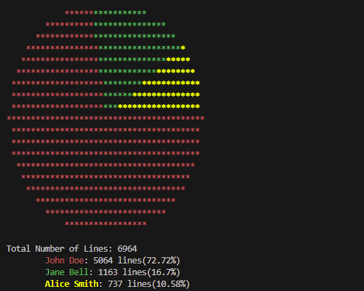

# GitPie
## Overview
Create a pie chart of authors' contributions to current lines of code in a git repository.
This script uses git blame to get the authors of each line in the repository.
The pie chart shows the percentage of lines contributed by each author.
The number of lines in the repository is displayed in the bottom right.
The pie chart can be saved to a file or displayed.
Authors and the number of lines they contributed can be saved to a file.
Authors can be loaded from a file to skip the git blame step.

## Usage
`usage: GitPie [-h] [-v] [-r REPO] [-l LOAD] [-a AUTHORS] [-o OUTPUT]`

Create a pie chart of authors contributions to current lines of code in a git repository

| Option              | Description                        |
|---------------------|------------------------------------|
| -h, --help          | Show this help message and exit    |
| -v, --verbose       | Verbose output                     |
| -r REPO, --repo REPO| Path to the git repository         |
| -l LOAD, --load LOAD| Load authors from file             |
| -a AUTHORS, --authors AUTHORS | File to write authors to |
| -o OUTPUT, --output OUTPUT | Output file for pie chart   |

## Future Work
- [ ] Add functionality to more easily combine multiple names for the same user
- [ ] Multi-threading for repository processing
- [ ] Add more visualization options